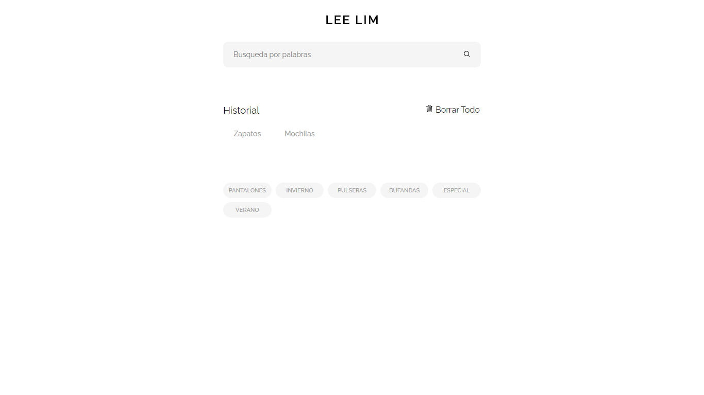
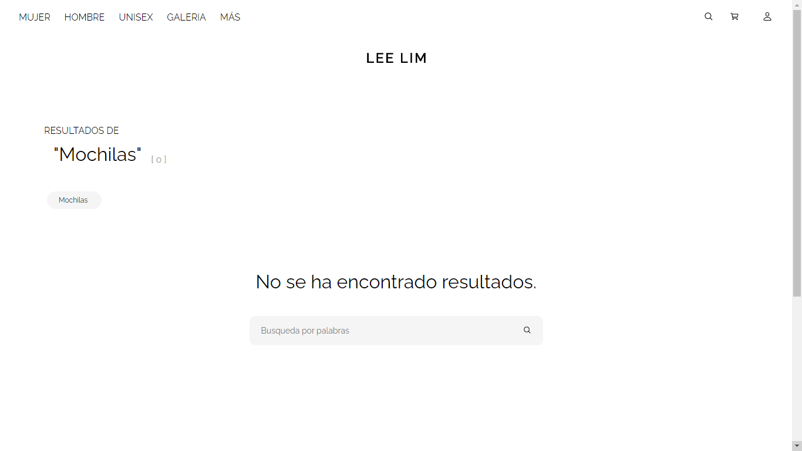
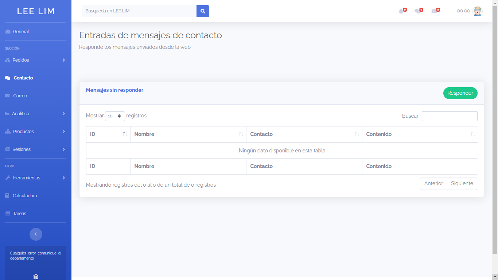

<h1 align="center">LEE LIM Beta website</h1>
<br>
<br>


<br>
<p align="center">
    
</p>

<br>


<p align="center">
  <a href="./CONTRIBUTING.md">Contributing</a>
  ·
  <a href="https://github.com/ZhengLinLei/leelim-beta-website/issues">Issues</a>
</p>

<p align="center">
  <a href="https://opensource.org/licenses/Apache-2.0">
    
  </a>&nbsp;
  <a>
    
  </a>
</p>

<hr>

This is a LAMP website, PHP version 7.2


# Index

1. [Quick start](#quick-start)
2. [Installation](#installation)
3. [Configuration](#configuration)
4. [Contribution](#contribution)
5. [Bugs](#bugs)


## <a name="quick-start"></a> 1. Quick Start

This project is based in e-commerce with LAMP system.

This project has got two parts:

    1. Customer part
    2. Admin part

**Customer part**: This is the part where the client are going to visit, the frontend. `./src/leelim`

**Admin part**: Where all the employers can access to view the packages and orders. `./src/leelim_backend`

-----------------

The helper used to pay are:

    1. [PayPal](https://paypal.com)
    2. [Stripe](https://stripe.com) (Credit and Debit card Online TPV)


----------------

**This project is not allowed to be copied for commercial projects.** Please read the [license](https://opensource.org/licenses/Apache-2.0) for more information.

### Frontend

Preview Images






### Backend

Preview Images





## <a name="installation"></a> 2. Installation

1. Clone the project or download the zip
```
git clone https://github.com/ZhengLinLei/leelim-beta-website.git
```

2. Download any Apache motor (XAMPP, WAMP, MAMP...)

    1. [XAMPP](https://www.apachefriends.org/es/index.html)
    2. [MAMP](https://www.mamp.info/)

3. Please read `./domain_config.txt` and follow the steps to prepare the domain

Copy this two code into the correct files:

**httpd-vhost.cnf**
```
    <VirtualHost *>
        DocumentRoot "C:\xampp\htdocs\zll\leelim"
        ServerName leelim.test
        <Directory "C:\xampp\htdocs\zll\leelim">
            Options All
            AllowOverride All
            Require all granted
        </Directory>
    </VirtualHost>
    <VirtualHost *>
        DocumentRoot "C:\xampp\htdocs\zll\leelim_backend"
        ServerName backend.leelim.test
        <Directory "C:\xampp\htdocs\zll\leelim_backend">
            Options All
            AllowOverride All
            Require all granted
        </Directory>
    </VirtualHost>
```

**hosts**
```
    127.0.0.1	leelim.test
    127.0.0.1	backend.leelim.test
```

**If you are using another local IP, so you have to change 127.0.0.1 to localhost:port or directly into the IP which you use for Local server**


## <a name="configuration"></a> 3. Configuration

1. Open your MySQL editor and import the two databases in `./backups` folder. Make sure that all names are correct or the website will append errorsmand you have to fix it manually. Open any [issues](https://github.com/ZhengLinLei/leelim-beta-website/issues) when you need help.

2. Once you have all imported into your MySQL, open the website [http://leelim.test](http://leelim.test). If you have changed the domain name, write the domain which you have changed, and do the same with [http://backend.leelim.test](http://backend.leelim.test).

3. When you open the website you will see some errors when you are using the website, that is because you have to change the internal keys for stripe and Paypal:

Open your code editor, and open the file `./src/leelim/view/api/private/import/module/cart/pay.php` and find the line [9] and change the key hash to your **stripe** account key.
```PHP
//INCLUDE STRIPE API SDK
require '../../../model/stripe-php/init.php';
//PRIVATE KEY
$key = 'sk_test_51Ihgw6J9HHZbmVICIuwN4usvDGSSNbxx9GPkaygf0ubDdGFrWPJOAy69awPaNz5en3bdBZnyjQa3MEHfqOhBHVp600bp1L****'; // ! PUT YOUR STRPE PRIVATE KEY
//DEFINE
$stripe = new \Stripe\StripeClient($key);
```

And in the line [99] the same for PayPal.
```PHP
$key_id = 'AWiyKSXaWWWBVzIxwzpRiYERzrxf7VjtQ9lDzojx9Qr1nA3ff3g4LjgwPDYCQ2uJGg2W4ci08649****'; // ! YOUR PAYPAL ID KEY
//PRIVATE KEY
$key = 'EPbI_vnbeCedt41gb-C20euY6mbi7v3BvAQGeF2CoXTH3i0Z-mKse-nIk9kxrA_urpnrACUaqeKb****'; // ! YOUR PAYPAL PRIVATE KEY
```


4. Do the same in `leelim_backend`, open the file `./src/leelim/controller/controller.php` and change you IMAP server data in line[14].
```PHP
function imap_login(){
    $user = 'account@test.com'; //EMAL ADDRESS
    $pass = '12345678'; //ACCOUNT PASSWORD
    return (imap_open("{imap.gmail.com:993/imap/ssl}INBOX",$user,$pass)); // EXAMPLE OF GMAIL IMAP ADDRESS
}
```


5. That's all, you have all configurated to use the project. Any problem feel free to open an [issue](https://github.com/ZhengLinLei/leelim-beta-website/issues)

## <a name="contribution"></a> 4. Contribution

Please read the `CONTRIBUTING.md` details steps to make pull request. Or contact the author in [issues](https://github.com/ZhengLinLei/leelim-beta-website/issues) section

## <a name="bugs"></a> 5. Bugs

Read `common_bugs.txt` or open an [issue](https://github.com/ZhengLinLei/leelim-beta-website/issues)